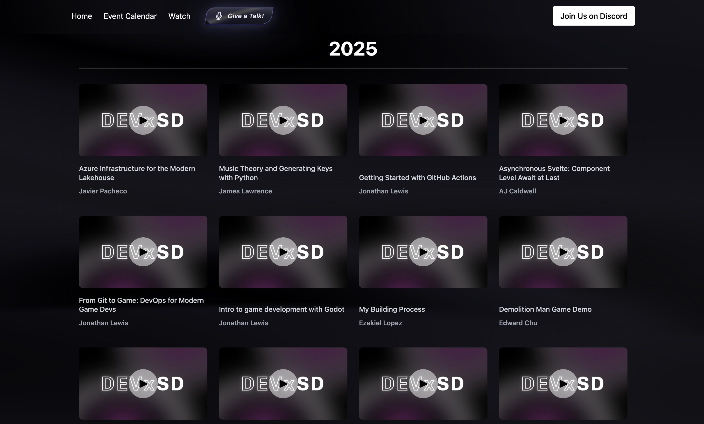

**Experience:**

# StayingInLJ - Social Commerce Platform
**Full-Stack E-Commerce Application**

Vintage furniture marketplace combining social media engagement with e-commerce functionality. Serves San Diego vintage business with nationwide reach through online sales and physical retail presence at Sea Hive Station.

**Key Accomplishments**

- Built full stack E-commerce marketplace using Node.js/Express and MongoDB transforming offline vintage business to digital-first platform
- Integrated Stripe payments and shipping APIs enabling complete transaction workflows with automated order processing
- Implemented security measures using Helmet.js and rate limiting deployed on Render with Cloudinary CDN achieving enterprise functionality

**Technical Architecture**

- Backend: Node.js/Express.js with MongoDB Atlas for scalable data management
- Payments: Stripe API with comprehensive checkout and shopping cart functionality
- Media: Cloudinary integration with owner-controlled crop positioning and optimization
- Security: Helmet.js implementation, rate limiting, and authentication management
- Infrastructure: Render hosting with health monitoring and automated scaling capabilities

**Key Features**

- Polaroid-style social feed with interactive engagement system
- Individual like system and right-sliding comment panels for enhanced user experience
- Google OAuth 2.0 and local authentication for flexible user access
- Owner dashboard with business analytics and inventory management
- Mobile-responsive glassmorphism design optimized for all devices

---

# Carmen's Cleaning - Professional Service Website
**Lead Management System**

Professional bilingual cleaning service website for Omaha Nebraska market. Astro-powered application with React islands architecture featuring lead management system, email automation, and Google OAuth admin dashboard. Supports English and Spanish with client-side language switching and localStorage persistence.

**Key Accomplishments**

- Delivered production Astro + React application with Supabase PostgreSQL backend and Netlify serverless functions for business transitioning from 18 years offline-only operations
- Architected lead management system with Resend email integration and Google OAuth admin dashboard enabling client to track quote requests and schedule appointments
- Implemented bilingual English/Spanish support with auto-detection and localStorage persistence achieving seamless language switching without page reloads
- Achieved 187 organic sessions and 2+ minute average engagement time within first month of launch without paid advertising demonstrating effective SEO and user experience design

**Technical Implementation**

- Frontend: Astro 5.x with React 19.x islands, TypeScript, Tailwind CSS 4.x
- Backend: Netlify Functions (serverless), Supabase (PostgreSQL)
- Authentication: Google OAuth 2.0 for admin access
- Email: Resend API for automated lead notifications
- Deployment: Netlify with CI/CD, environment variable management
- Key Features: Bilingual form validation, CSV export, mobile-responsive design, admin dashboard
- Performance: 100 desktop and 98 mobile PageSpeed scores through efficient Astro static generation and image optimization

**Technologies:** Astro, React, TypeScript, Tailwind CSS, Supabase, Netlify, Google OAuth
**Live Site:** [carmens-cleaning.com](https://carmens-cleaning.com)

---

# Contindex
**A CLI Tool for AI Context Management**

Command line utility built in Go for processing and transforming AI context files. Streamlines developer workflows when working with large codebases and AI-assisted development tools.

**Key Accomplishments**

- Developed CLI tool using Go for AI context file processing streamlining developer workflows with large codebases
- Implemented efficient file handling and transformation algorithms reducing context preparation time for AI assisted development
- Built cross platform binary distribution enabling seamless integration across development environments

*Visual showing processing and transformation capabilities*

**Technical Implementation**

- Core language: Go for performance and cross-platform compatibility
- File processing: Handles large context files with efficient memory management
- CLI interface: User-friendly command structure with comprehensive help documentation
- Integration: Works seamlessly with existing AI development workflows

**Key Features**

- Fast processing of AI context files regardless of codebase size
- Flexible transformation options for different AI assistant requirements
- Cross-platform binary distribution for easy installation
- Minimal dependencies for reliable execution across environments

**Technologies:** Go, CLI Development, File Processing
**Repository:** [github.com/AngelCodes95/contindex](https://github.com/AngelCodes95/contindex)

# Terminal Jarvis - AI Development Tools Hub
**Landing Page Development & Project Maintainer**

Professional landing page and ongoing maintenance for CLI-based AI tool switcher. Terminal Jarvis unifies multiple AI coding assistants including Claude, Gemini, OpenCode, and LLM interfaces through a single terminal application.

**Key Accomplishments**

- Built responsive landing page using HTML/CSS/JavaScript creating professional web presence for open source AI tools project
- Designed terminal-themed interface with animated loading sequences matching CLI application aesthetic and user experience
- Maintain project direction through code reviews and architectural guidance supporting active developer community

*Landing page light and dark modes*

**Technical Implementation**

- Frontend: Vanilla JavaScript, CSS animations, responsive design
- Key Features: Terminal-style loading animations, mobile optimization, GitHub Pages deployment
- Live Site: [angelcodes95.github.io/terminal-jarvis-landing](https://angelcodes95.github.io/terminal-jarvis-landing/)
- Repository: [github.com/AngelCodes95/terminal-jarvis-landing](https://github.com/AngelCodes95/terminal-jarvis-landing)

---

# Generator Screaming Bones
**React + TypeScript Project Generator**

Yeoman generator implementing Screaming Architecture principles with opinionated tooling setup including Vite, ESLint, Prettier, and optional Tailwind CSS integration. Organizes code by business domain rather than technical layers, creating self-documenting project structures.

**Key Accomplishments**

- Developed automated scaffolding using Yeoman + Node.js eliminating repetitive React + TypeScript project setup
- Implemented domain-driven architecture with ESLint 9 + Prettier 3.x enforcing consistent patterns across projects
- Published NPM package with 300+ downloads reducing project initialization from hours to minutes

*CLI scaffolding tool process flow showing initialization, user input validation, configuration assembly, and project generation stages.*

**Technical Implementation**

- Performance: 30-90 second generation time with 2-3 second cold start, ~500ms template processing per file
- Technologies: Node.js, Yeoman, TypeScript, Vite, ESLint 9, Prettier 3.x
- Key Features: Interactive CLI validation, EJS templating, conditional feature setup, Git initialization
- Repository: [github.com/AngelCodes95/generator-screaming-bones](https://github.com/AngelCodes95/generator-screaming-bones)
- NPM Package: [npmjs.com/package/generator-screaming-bones](https://www.npmjs.com/package/generator-screaming-bones)

---

# DEVx Network - Speaker Archive Feature
**Open Source Collaboration** | **Pull Request:** [github.com/DEVxNetwork/devx.network/pull/39](https://github.com/DEVxNetwork/devx.network/pull/39)

Designed and implemented speaker-focused archive page for San Diego tech community nonprofit. Contribution underwent architectural evolution through collaborative code review process, demonstrating adaptability and receptiveness to technical feedback. Feature enables community members to explore 31+ speaker talks from DEVx Network livestreams organized by year with direct YouTube integration.

**Key Accomplishments**

- Contributed React feature implementation through iterative code review process pivoting from livestream embeds to speaker-centric grid layout based on architectural guidance
- Structured data model with 31 speaker entries including timestamp handling and YouTube URL parameters enabling precise navigation to individual talks
- Collaborated with maintainers adapting design from archive-focused to engagement-driven approach directing traffic to YouTube channel for community growth

**Technical Implementation**

- Frontend: React with TypeScript, responsive grid layout, year-based organization
- Data Structure: Centralized talks.ts with speaker metadata and YouTube integration
- Code Review: Multiple commit cycles incorporating feedback on component organization, memoization strategies, and visual design consistency

**Collaboration Highlights**

- Refactored initial implementation based on product direction feedback transforming embedded archive into speaker showcase
- Adopted atomic commit conventions mid-project improving git history clarity
- Discussed future enhancement strategies including YouTube API integration for dynamic data management
- Maintained clear communication throughout review process demonstrating professional development practices

**Technologies:** React, TypeScript, YouTube API Integration, Component Architecture
**Status:** Merged to production October 2025

---

# Together, A Calendar App for 100Devs
**Open Source MERN Stack Contributions**

Contributed critical bug fixes to open source group calendar application for the 100Devs community. Resolved production OAuth authentication failures affecting user login in Fly.io deployment environment and restored essential session management functionality. Successfully merged multiple pull requests to production.

**Key Accomplishments**

- Contributed OAuth authentication fixes using MERN stack resolving production failures in Discord community calendar
- Deployed personal production environment on Fly.io with MongoDB cluster replicating production conditions for testing
- Documented bug fixes and feature enhancements achieving successful Open Source contribution

**Technical Details**

- Technologies: MongoDB, Express.js, React, Node.js, OAuth, Fly.io
- Key Features: Production debugging, OAuth implementation, session management, deployment troubleshooting
- Repository: [github.com/AngelCodes95/together](https://github.com/AngelCodes95/together)

---

**Technical Focus Areas**

- Architecture patterns and code organization over framework dependency
- Developer experience optimization and tooling
- Go for CLI development and file processing
- Modern JavaScript ecosystem and build automation

---

[Click to go to the Skills Section](skills.md)