# Personal Life

This page will give you a glimpse in to my life that is not work related, or tech related.

---
 Born 1995, lived on the west coast until I was around 8 years old then moved to Omaha, Nebraska. 

Here is the home in NE that I grew up in, you can tell who was in charge of mowing the lawn as a kid based on the angle of the photo I took once upon a time and saved all these years.

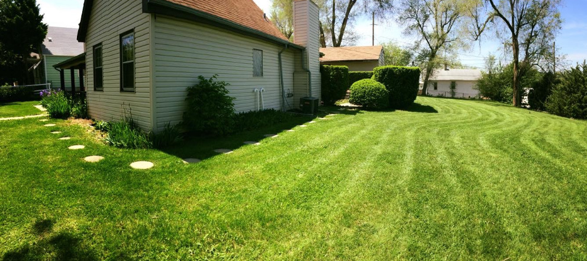

---
What better way to get to know me than starting off with very embarrassing childhood photos. Although, now that I am older (and bald) I am less embarrassed by them and more envious of all that hair! The Phat-Farm shoes!!

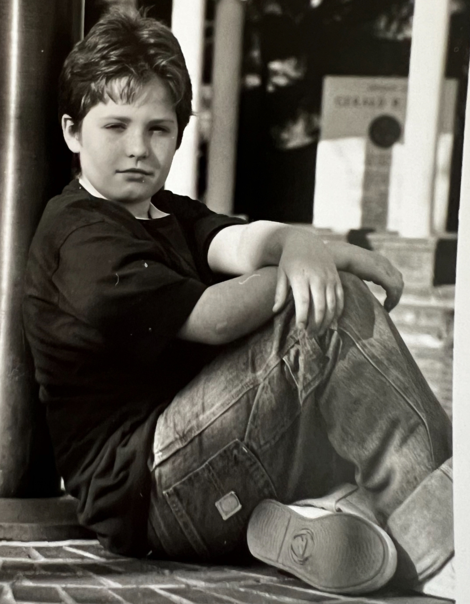{: .small } 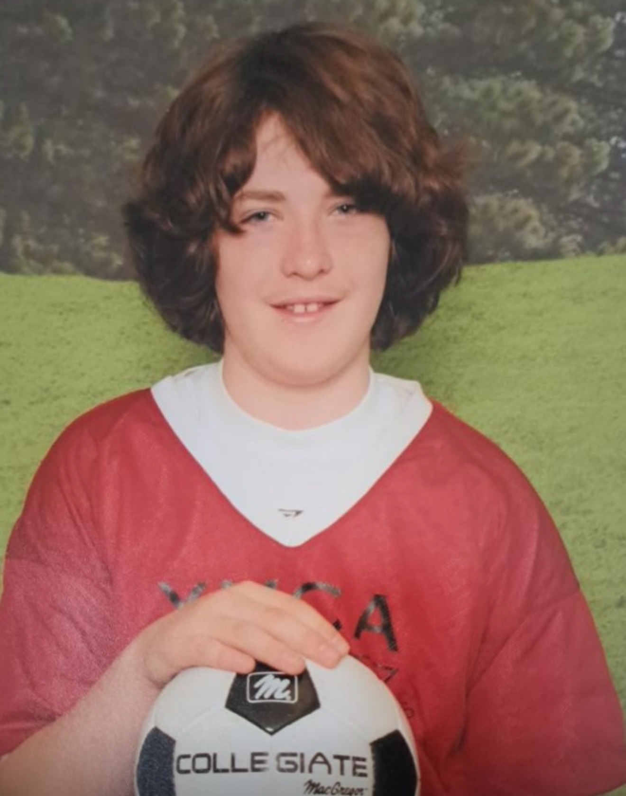{: .small }

---
## Family

I come from a family of car enthusiasts on both sides. I ran around in a diaper with a wrench in my hand. I always had to take things apart and put them together as a kid, I needed to know how EVERYTHING worked, not just how to use it. 

If you come over on the weekend you're bound to find my family in the garage or outside like this:

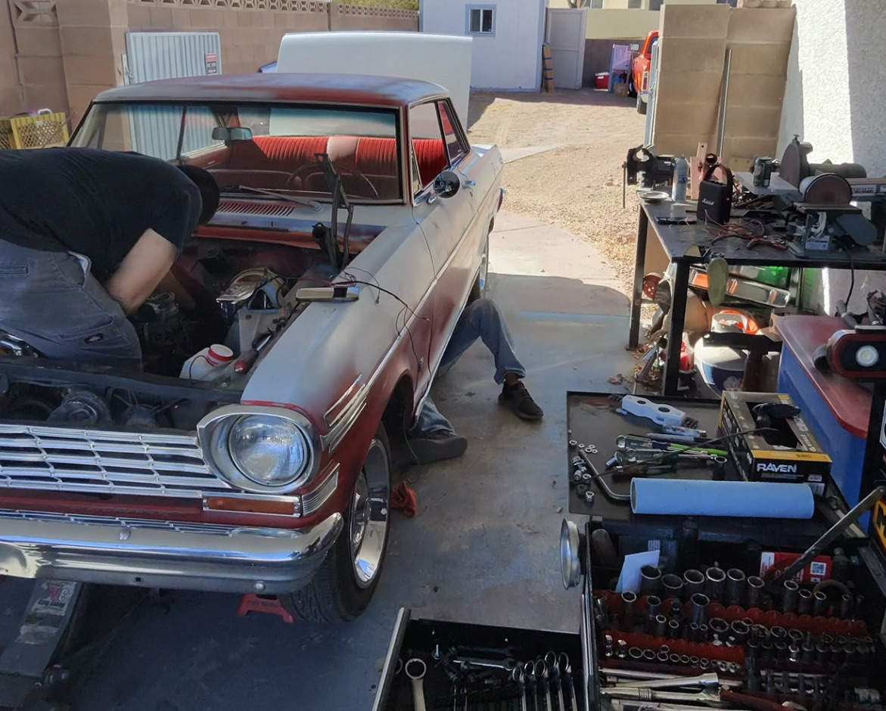

---

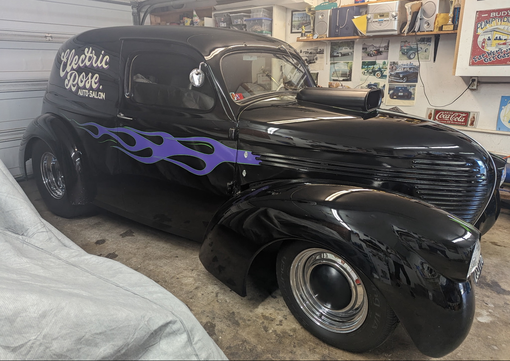

When I said both sides of the family, I mean it. Combined, there are too many cars to post, but here is one of my favorites! The second photo is my **GRANDMA's** car... yes, you read that right! 

The mechanical aptitude didn't come from nowhere. Wrenching with family taught me that everything can be fixed if you're willing to get your hands dirty and think through the problem systematically, breaking things down into the smallest pieces to adjust and try again if needed. 
This is where I learned that the best solutions come from understanding how things work from the ground up. 

Whether it's debugging code or rebuilding an engine, the principle is the same.

---
## The Journey West

In my early 20's I did what few midwestern kids dare to do... In 2018 I left for the big city! Moved to San Diego and have loved living in the La Jolla Village ever since! Pretty hard to wake up on the wrong side of bed when its sunny and 72°F almost everyday!

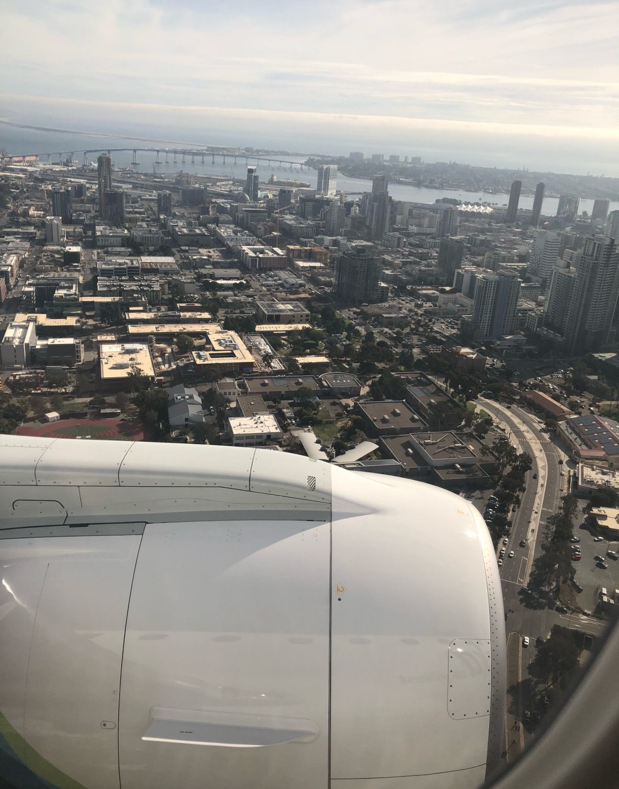

---
## Life Now

I like to spend my free moments balancing screentime with outdoor time. My favorite hobbies are gaming, going for hikes, and driving around to explore the city. **If I happen upon a delicious foodspot while out cruising... you didn't see me!**
Here's my beautiful lady and I on a hike along Torrey Pines. If you zoom in you can see gliders floating along the coast!
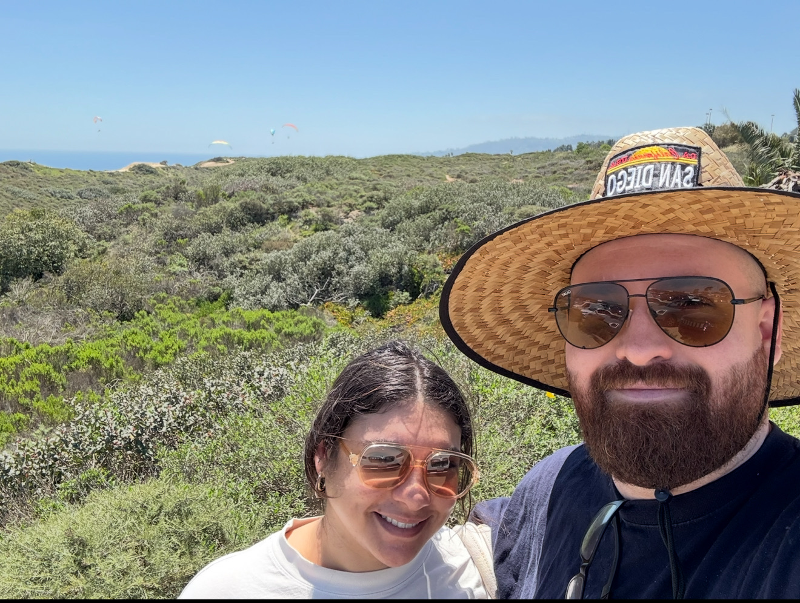

Speaking of delicious food spots... I have to make my way up to LA on occasion to visit one of my favorite spots in all of California. King Taco! Off East 3rd st in East LA. BEST FOOD IN TOWN is right! 

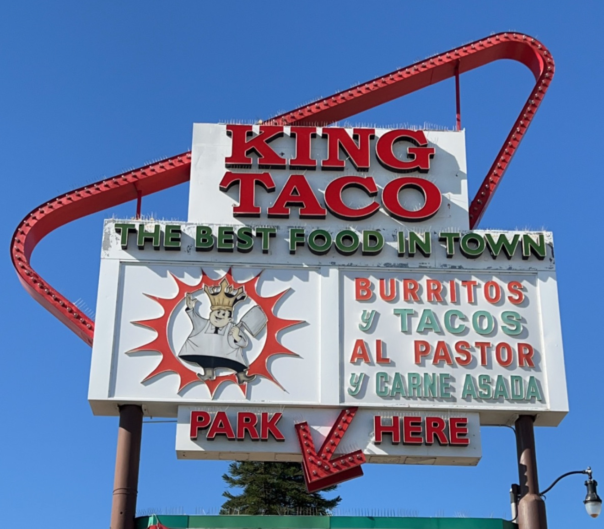

---

## Home stretch, a few last things!

No children, but I do have two wonderful cats. Meet JerrBear and Zippy 

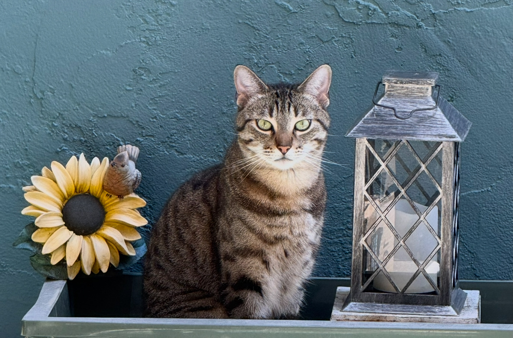{: .small-50 } 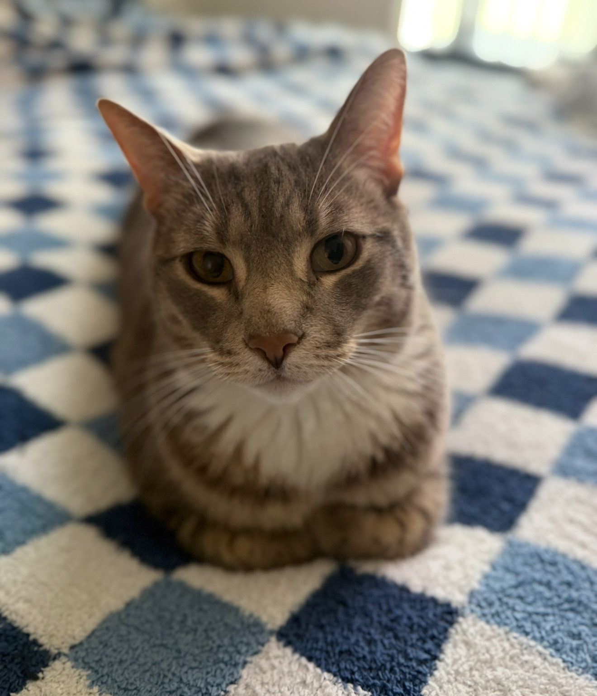{: .small-30 }

## The Point of this section in the first place

This isn't a typical page to add to a portfolio and that is fully intentional. I feel that authenticity beats perfection every time. From embarrassing photos to working on cars in the garage to hiking all over the west coast with my partner, these moments throughout my life all played a key piece in my story and shaped the developer I became with the unique perspective I bring to every problem I solve. 

The same curiosity that made me take apart everything as a kid is what drives me to understand how systems work today, especially when I don't have formal education on them. The work ethic learned in those family garage sessions translates directly to debugging applications at 2 AM.

I am no stranger to getting my hands dirty and working hard. One of my favorite career opportunities was a promotion from Lead Welder to Supervisor of the Paintline during my days with a fortune 500 Manufacturing company in town.

 I would come home absolutely filthy everyday with a sense of exhaustion that let me know I worked hard enough that day. It still left me yearning for the same thing I've tried to find in every other career... a true sense of accomplishment and mental stimulation. 

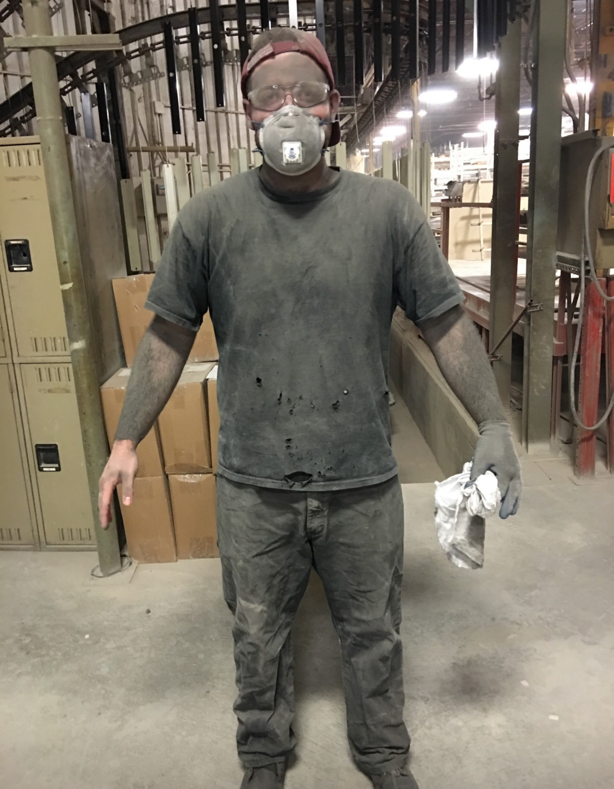{: .small }

When I create a solution, solve a client's problem, fix a bug, refactor code successfully, see all my tests pass, or see "no errors" after I build something I finally get a dose of what I've been looking for. That is an indication to me that I am moving in the direction of what I am meant to be doing. 

Thank you for taking time to learn about me, please reach out to me directly via [LinkedIn](https://www.linkedin.com/in/angelthedev/) with any further questions.

---

[Click to go to the Highlights Section](index.md)