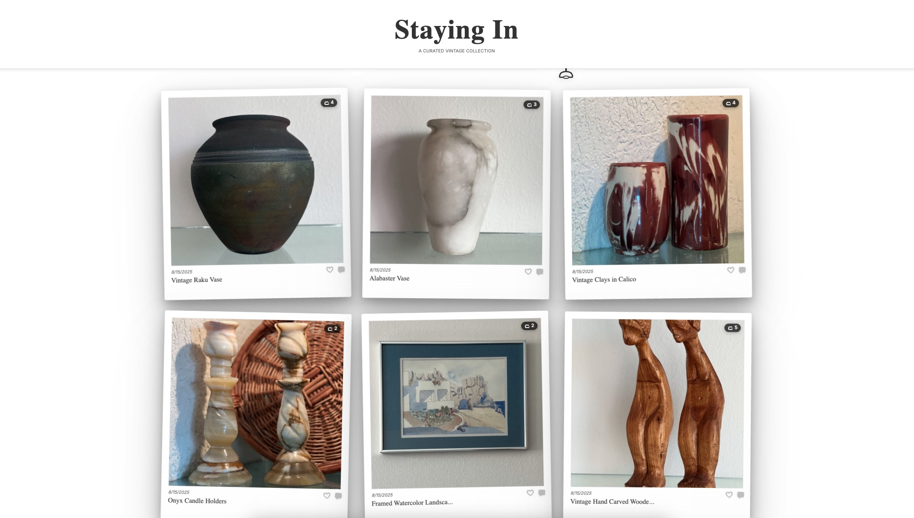

# Projects

## Generator Screaming Bones
**React + TypeScript Project Generator | 18 Weekly Downloads**

Yeoman generator implementing Screaming Architecture principles with opinionated tooling setup including Vite, ESLint, Prettier, and optional Tailwind CSS integration. Organizes code by business domain rather than technical layers, creating self-documenting project structures.

**Challenge Solved:** Eliminate repetitive project setup and enforce consistent architecture patterns across React + TypeScript projects while maintaining flexibility for different use cases.

**Architecture Decision:** Implemented domain-driven folder structure where "folder structure communicates what the application does" rather than traditional technical layer organization, improving code maintainability and onboarding efficiency.

*CLI scaffolding tool process flow showing initialization, user input validation, configuration assembly, and project generation stages.*

**Performance:** 30-90 second generation time with 2-3 second cold start, ~500ms template processing per file  
**Technologies:** Node.js, Yeoman, TypeScript, Vite, ESLint 9, Prettier 3.x  
**Key Features:** Interactive CLI validation, EJS templating, conditional feature setup, Git initialization  
**Repository:** [github.com/AngelCodes95/generator-screaming-bones](https://github.com/AngelCodes95/generator-screaming-bones)  
**NPM Package:** [npmjs.com/package/generator-screaming-bones](https://www.npmjs.com/package/generator-screaming-bones)

---

## Together, A Calendar App for 100Devs
**Open Source MERN Stack Contributions**

Contributed critical bug fixes to open source group calendar application for the 100Devs community. Resolved production OAuth authentication failures affecting user login in Fly.io deployment environment and restored essential session management functionality. Successfully merged multiple pull requests to production.

**Challenge Solved:** Diagnosed and fixed OAuth authentication failures in production environment by deploying local Fly.io instance with MongoDB cluster and Discord authentication to accurately replicate production conditions and test fixes.

**Technical Implementation:** Built local production environment replica using Fly.io CLI, configured MongoDB Atlas connection strings, and implemented Discord OAuth flow debugging to isolate session persistence issues in containerized deployment.

**Technologies:** MongoDB, Express.js, React, Node.js, OAuth, Fly.io  
**Key Features:** Production debugging, OAuth implementation, session management, deployment troubleshooting  
**Repository:** [github.com/AngelCodes95/together](https://github.com/AngelCodes95/together)

---

## StayingInLJ - Social Commerce Platform
**Full-Stack E-Commerce Application**

Vintage furniture marketplace combining social media engagement with e-commerce functionality. Serves San Diego vintage business with nationwide reach through online sales and physical retail presence at Sea Hive Station.

**Challenge Solved:** Transformed a once exclusively offline vintage business operation into digital-first marketplace, enabling nationwide customer reach while preserving intimate browsing experience. Created unique platform combining Instagram-style social interactions with full e-commerce functionality.

**Business Impact:** Complete marketplace solution with automated order processing, Stripe payment integration, shipping automation via Shippo API, and multi-channel fulfillment (pickup, local delivery, nationwide shipping). Achieved enterprise functionality at no monthly infrastructure cost. Eventually with business growth premium tiers of the integrations will be necessary. 

**Technical Architecture:**

- **Backend:** Node.js/Express.js with MongoDB Atlas
- **Payments:** Stripe API with guest checkout and shopping cart functionality  
- **Media:** Cloudinary with owner-controlled crop positioning
- **Security:** Helmet.js, rate limiting
- **Infrastructure:** Render hosting with health monitoring and automated scaling

**Key Features:** Polaroid-style social feed, individual like system, right-sliding comment panels, Google OAuth 2.0 + local auth, owner dashboard with business analytics, mobile-responsive glassmorphism design

## Interactive Portfolio
**3D Wireframe Pyramid Portfolio**

Unique portfolio experience featuring 3D wireframe pyramids with physics-based animations, SVG rendering, and responsive touch controls. Demonstrates advanced mathematical concepts and interactive web development techniques.

**Challenge Solved:** Create memorable, interactive portfolio that showcases technical creativity while maintaining professional presentation and optimal performance across desktop and mobile devices without external libraries.

**Technologies:** JavaScript, SVG, 3D Mathematics, CSS Animations  
**Key Features:** Physics simulations, mobile touch controls, color-changing animations  
**Live Demo:** [angel-vazquez.com](https://angel-vazquez.com)  
**Repository:** [github.com/AngelCodes95/angel-vazquez-com](https://github.com/AngelCodes95/angel-vazquez-com)

---

**Technical Focus Areas**

- Architecture patterns and code organization over framework dependency
- Developer experience optimization and tooling
- Interactive web experiences and animation techniques
- Modern JavaScript ecosystem and build automation

**Interests & Currently learning**

- CI/CD workflows
- Yaml
- Rust
- Python